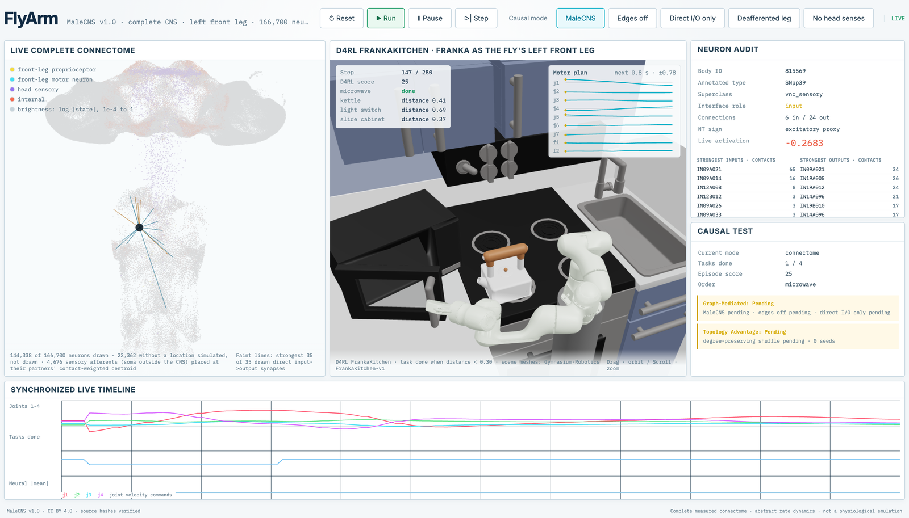
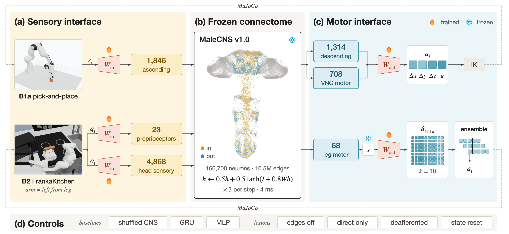
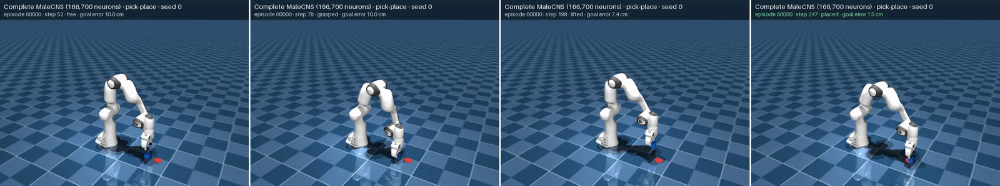
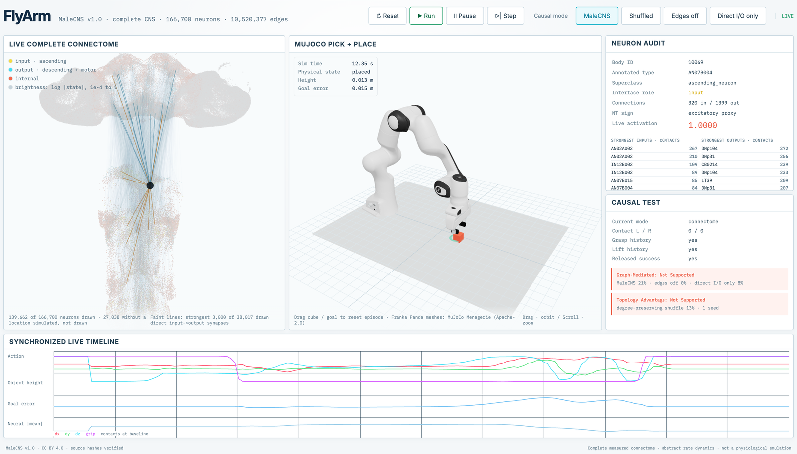

# FlyArm

**一只果蝇的完整大脑接线图，不改一根线，驱动一台 Franka 机械臂。**

A frozen, complete fruit-fly central nervous system (MaleCNS v1.0: 166,700 neurons, 10.5 M connections) is the controller of a simulated Franka arm.
Only a linear map into sensory neurons and a linear map out of motor neurons are trained.
It runs in real time on a Mac (MLX, 4 ms per control step).



## How it works



- **The brain is not trained.** Connection weights come from measured synapse counts, and the only path from inputs to outputs runs through the connectome.
- **Biologically mapped I/O.** In FrankaKitchen the arm is the fly's left front leg: joint angles enter through its 23 leg proprioceptors, the scene through 4,868 head sensory neurons, and actions are read from its 68 leg motor neurons, all selected by annotation rules.
- **Causal controls, as in neuroscience.** Every result is compared with a degree-preserving shuffle of the same CNS, a parameter-matched GRU and an MLP, and checked with lesions: edges off, direct synapses only, deafferentation, state reset every step.

## Results so far

Real-contact pick and place, 3 training seeds x 24 held-out episodes:

| Controller | Grasp | Lift | Stable place |
|---|---:|---:|---:|
| Complete MaleCNS | 69/72 | **58/72** | 14/72 |
| Shuffled CNS (same degrees) | 65/72 | 27/72 | 10/72 |
| GRU, parameter-matched | 43/72 | 33/72 | 4/72 |
| MaleCNS, every edge removed | 11/72 | 0/72 | 0/72 |
| MaleCNS, state reset every step | 60/72 | 0/72 | 0/72 |



In progress: a replication with 6 seeds and several shuffles per seed, and D4RL FrankaKitchen with ACT-style action chunking for every controller.
The first new seed favours the shuffle, so a topology advantage is not yet a claim.
Details: [whole-brain controller](docs/WHOLE_BRAIN.md), [kitchen protocol and findings](docs/B2_FLYLEG_GOAL.md).



## Run

Apple Silicon, Python 3.12 and [uv](https://docs.astral.sh/uv/); downloads are about 1.1 GB.

```bash
uv sync
uv run flyarm fetch
uv run flyarm whole-brain compile
uv run flyarm whole-brain run --config configs/whole-brain-pick-place.json --output runs/pick-place
uv run flyarm flyleg run --config configs/flyleg-kitchen-complete-chunk.json --output runs/kitchen

cd ui && npm ci && npm run build && cd ..
uv run flyarm flyleg serve --run runs/kitchen --seed 0 --port 8771
```

## Scope

- An abstract rate model on the measured wiring, not a physiological or spiking emulation of the fly.
- Observations are simulator state, not vision.
- Simulation only.

Data: MaleCNS v1.0 (CC BY 4.0).
Robot: MuJoCo Menagerie Franka Panda (Apache 2.0) and Gymnasium-Robotics FrankaKitchen.
Code: MIT; see [third-party attribution](THIRD_PARTY.md).
