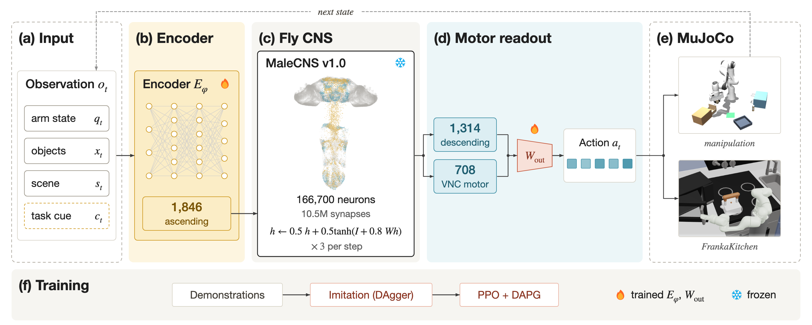

# FlyArm

**一只果蝇的完整大脑接线图，不改一根线，驱动一台 Franka 机械臂。**

A frozen, complete fruit-fly central nervous system (MaleCNS v1.0: 166,700 neurons, 10.5 M measured connections) is the controller of a simulated Franka arm.
The connectome is never trained; only a sensory encoder into its ascending neurons and a linear decoder out of its descending and motor neurons are.
It runs in real time on a Mac (MLX, about 4 ms per control step).

**Interactive site: [yusenthebot.github.io/FlyArm](https://yusenthebot.github.io/FlyArm/)**, the arm and the connectome's recorded activity on the same frames, and a lesion lab to try.

**Videos: the frozen fly connectome controls the arm**
- [The arm and the brain together](docs/videos/fly-brain-demo-vertical.mp4): a seven-subgoal task with objects never seen in training, with 3,200 sampled neurons of the connectome lit by their activity on every frame (vertical, 24 seconds).
- [Drawers, a lidded cabinet, shelves, a bin and stacking](docs/videos/fly-brain-highlights.mp4): one successful test episode of each of the seven task templates (2 minutes).
- [Objects never seen in training](docs/videos/fly-brain-unseen-objects.mp4): the seven templates with held-out scanned objects (2 minutes).
- [Task orders never seen in training](docs/videos/fly-brain-unseen-composition.mp4): two held-out compositions of 5 and 6 subgoals (40 seconds).
- [The same episode with the brain intact, its state cleared, and lesioned](docs/videos/fly-brain-lesions.mp4): the trained controller succeeds with the intact connectome and fails when its recurrent state is cleared every step or its VNC interneurons are silenced.
- [FrankaKitchen](docs/videos/kitchen-four-tasks-perturbed.mp4): all four tasks from perturbed starts never trained on.

## Pipeline



- **Input.** Simulator state: the arm, the objects, the scene and, on the manipulation benchmark, a task cue (current skill, object and target).
- **The brain is not trained.** Weights are measured synapse counts; each control step runs three steps of a rate model on the whole CNS, and the only path from inputs to outputs runs through it.
- **Trained interface.** An encoder writes currents into the 1,846 ascending neurons; a linear decoder reads the 1,314 descending and 708 VNC motor neurons into the action.
- **Training.** Imitation of a teacher with DAgger, then PPO with a demonstration term (DAPG); on the manipulation benchmark PPO also trains the encoder, through one control step of the frozen connectome.

Figure caption and sources: [docs/figures/pipeline-caption.md](docs/figures/pipeline-caption.md).

## Results

### Articulated multi-step manipulation

Drawers, a lidded cabinet with a shelf, a bin, a target region and stacking, with 41 scanned household objects; seven task templates of 3 to 7 subgoals and four held-out compositions of 5 to 8 (1,100 to 2,600 control steps at 20 Hz); five preregistered splits ([environment](docs/MANIPULATION_ENV.md)).
Full-task success from true starts, 32 fresh test episodes per template never used for training or checkpoint selection, with Wilson 95% intervals ([results](docs/results/manipulation-final.json)):

| Split | Imitation | + PPO (encoder and decoder) |
|---|---:|---:|
| iid | 63.4% | **76.3%** (70 to 81) |
| unseen objects | 64.7% | **82.6%** (77 to 87) |
| unseen furniture | 28.1% | **36.6%** (31 to 43) |
| unseen composition | 17.2% | **26.6%** (20 to 35) |

The controller is not told which motor phase it is in: an earlier version whose task cue included an observable motor phase (aligned, at height, grasped, above the target) reached 69.6%, 75.0%, 36.6% and 26.6% with the same recipe, so the connectome controller recovers the phase from the rest of the observation and its own recurrent state.
The privileged scripted teacher solves 111 of the first 112 of these iid episodes (and 111, 110 and 61 of 112, 112 and 64 on the held-out splits).
Failures concentrate in placing on the shelf and in the region, in furniture outside the training ranges, and in retrieving from a drawer to the shelf.

### FrankaKitchen

All four tasks of D4RL kitchen-complete in the official Gymnasium-Robotics environment, 50 test episodes per condition ([milestone](docs/MILESTONE_KITCHEN.md)):

| Start | Benchmark score | All four tasks | Strict score, motion-quality controller |
|---|---:|---:|---:|
| Benchmark start | 100.0 | 50/50 | 69.5 |
| 0.2 rad perturbed (never trained on) | 100.0 | 50/50 | 70.5 |
| 0.3 rad perturbed (never trained on) | 100.0 | 50/50 | 68.0 |

### Lesions

The trained controller is lesioned at test time, without retraining, on 112 iid test episodes ([research log E63](docs/RESEARCH_LOG.md), [figure](docs/figures/lesion-figure.png)):

| Lesion | Neurons silenced | Successes | Same-size random sets |
|---|---:|---:|---:|
| None | 0 | 87/112 | |
| State cleared before every control step | 0 | 0/112 | |
| VNC interneurons | 13,161 | 46/112 | 84, 79 |
| Optic lobes | 99,167 | 94/112 | 39, 1 |
| Central brain | 32,164 | 82/112 | 75, 75 |
| Every neuron but the interface | 162,832 | 16/112 | |

The controller depends on the connectome's state across control steps, and on specific anatomy rather than neuron count: the VNC interneurons between descending and motor neurons are needed beyond their number, and the optic lobes, which get no input here, can be removed.

### Controls

Whether the measured wiring trains better than another graph is not yet claimed.
Two more training seeds of the connectome and a degree-preserving shuffle with three seeds run through the identical pipeline under a protocol fixed before their results (research log, "Report rigor plan").

## Scope and limits

- Observations are simulator state, not vision, and the manipulation task cue (current skill, object and target) comes from the task plan and the simulator state.
- An abstract rate model on the measured wiring, not a physiological or spiking emulation of the fly.
- Simulation only; the manipulation results are one training seed so far (the kitchen four-task stage replicates on three PPO seeds).

## Run

Apple Silicon, Python 3.12 and [uv](https://docs.astral.sh/uv/); the connectome download is about 1.1 GB.

```bash
uv sync
uv run flyarm fetch
uv run flyarm whole-brain compile

# manipulation: skill-level DAgger, then PPO on encoder and decoder
uv run flyarm manipulation skill-dagger --config configs/skill-dagger-connectome-nophase.json --output runs/skill-dagger-connectome-nophase-001
uv run flyarm rl manipulation --config configs/ppo-manipulation-nophase.json --output runs/ppo-manipulation-nophase-001
uv run python scripts/final_evaluation.py --policy final=ppo:runs/ppo-manipulation-nophase-001@500 --output runs/final.json

# kitchen: see docs/MILESTONE_KITCHEN.md for the full recipe
uv run python scripts/kitchen_final_eval.py runs/kitchen.json LABEL=RUN/policy-XXXX.safetensors
```

Each config names the run it starts from, so the stages run in this order.
The history of every experiment, including what did not work, is in [docs/RESEARCH_LOG.md](docs/RESEARCH_LOG.md).

Data: MaleCNS v1.0 (CC BY 4.0).
Robot: MuJoCo Menagerie Franka Panda (Apache 2.0) and Gymnasium-Robotics FrankaKitchen.
Code: [Apache License 2.0](LICENSE); data, models and assets keep their own terms, see [third-party attribution](THIRD_PARTY.md).
